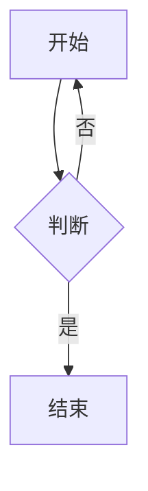
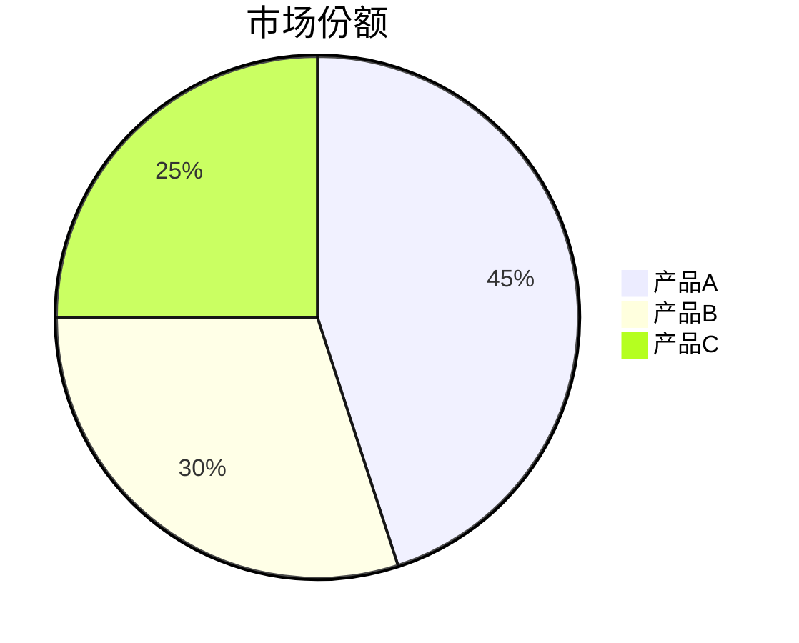
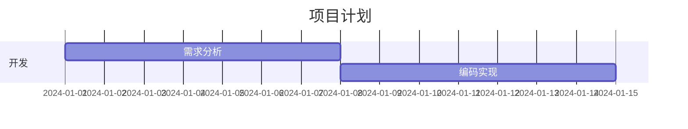

# Markdown转DOCX Web应用

一个简单、优雅的Web应用程序，用于将Markdown文档转换为Microsoft Word（DOCX）文档，支持自定义Word模板。

## ✨ 功能特点

- 📝 **Markdown编辑器**：直接在浏览器中粘贴或编辑Markdown内容
- 👁️ **实时预览**：即时查看Markdown渲染效果
- 🎨 **模板支持**：使用.dotx模板文件自定义文档样式
- ⚡ **快速转换**：一键将Markdown转换为专业的Word文档
- 🔧 **Pandoc引擎**：使用业界标准的Pandoc进行转换，质量更高
- 🎯 **Mermaid图表**：纯Python渲染Mermaid图表为图片（无需Node.js）
  - ✅ 支持 graph TD/LR 流程图（使用智能分层布局算法）
  - ✅ 支持饼图、甘特图等多种图表类型
  - ✅ 完全离线渲染，高清图片输出（150 DPI）
  - ✅ 自动识别节点依赖关系，正确排列布局
- 📊 **格式支持**：标题、表格、列表、代码块、图片、链接、Mermaid图表等
- 🌐 **友好界面**：现代化、响应式的用户界面

## 🚀 快速开始

### 方法一：快速安装（推荐）⭐

**步骤1：安装系统依赖**
```bash
# 运行系统依赖安装脚本（需要sudo权限）
bash setup.sh
```

脚本会自动安装：
- ✅ Pandoc（文档转换引擎）
- ✅ 中文字体（文泉驿字体）
- ✅ 清理matplotlib字体缓存

**步骤2：安装Python依赖**
```bash
pip install -r requirements.txt
```

**步骤3：启动应用**
```bash
python3 app.py
```

访问 `http://127.0.0.1:5000` 开始使用！

### 方法二：手动安装

#### 环境要求

- Python 3.8+
- Pandoc 2.x+（文档转换引擎）

#### 1. 安装Pandoc

**Windows：**
```powershell
winget install pandoc
# 或者使用 Chocolatey
choco install pandoc
```

**Linux (Ubuntu/Debian)：**
```bash
sudo apt-get update
sudo apt-get install -y pandoc
```

**Linux (CentOS/RHEL)：**
```bash
sudo yum install -y pandoc
```

**Mac：**
```bash
brew install pandoc
```

验证安装：
```bash
pandoc --version
```

#### 2. 安装Python依赖

```bash
pip install -r requirements.txt
```

依赖包说明：
- `Flask` - Web框架
- `pypandoc` - Pandoc Python接口
- `markdown` - Markdown预览
- `matplotlib` - 图表绘制（Mermaid渲染）
- `networkx` - 图网络算法（流程图布局）

#### 3. 安装中文字体支持（可选但推荐）

**Linux：**
```bash
# 安装文泉驿字体
sudo apt-get install -y fonts-wqy-zenhei fonts-wqy-microhei

# 清除matplotlib字体缓存
rm -rf ~/.cache/matplotlib
```

**Windows/Mac：**
系统自带中文字体，无需额外安装

#### 4. 测试安装

```bash
# 测试Mermaid渲染
python mermaid_python_renderer.py

# 测试转换功能
python md_to_docx_converter.py
```

#### 5. 启动应用

```bash
python app.py
```

#### 6. 访问应用

打开浏览器访问：`http://127.0.0.1:5000`

## 📖 使用说明

1. **输入内容**：在左侧文本框中粘贴或输入Markdown内容
2. **预览效果**：右侧会自动显示渲染后的预览效果
3. **选择模板**：（可选）从下拉菜单中选择Word模板
4. **设置文件名**：输入期望的输出文件名
5. **转换下载**：点击"转换并下载"按钮

## 📁 项目结构

```
md2docx/
├── app.py                      # Flask应用主程序
├── md_to_docx_converter.py     # Markdown转DOCX核心转换模块
├── mermaid_renderer.py         # Mermaid图表渲染器
├── mermaid_python_renderer.py  # 纯Python Mermaid渲染实现
├── fix_mermaid_syntax.py       # Mermaid语法修复工具
├── requirements.txt            # Python依赖包列表
├── README.md                   # 项目说明文档
├── templates/                  # HTML模板文件夹
│   └── index.html             # 主页面HTML
└── templates_docx/            # Word模板存放文件夹
    ├── README.md              # 模板使用说明
    └── *.dotx                 # .dotx模板文件
```

## 🎨 支持的Markdown语法

### 标题
```markdown
# 一级标题
## 二级标题
### 三级标题
```

### 文本格式
```markdown
**粗体文本**
*斜体文本*
`行内代码`
```

### 列表
```markdown
- 无序列表项1
- 无序列表项2

1. 有序列表项1
2. 有序列表项2
```

### 表格
```markdown
| 列1 | 列2 | 列3 |
|-----|-----|-----|
| 数据1 | 数据2 | 数据3 |
```

### 代码块
````markdown
```python
def hello():
    print("Hello World")
```
````

### Mermaid图表

支持多种Mermaid图表类型，使用纯Python渲染，无需Node.js：

**流程图（graph TD/LR）：**
````markdown

````

**饼图：**
````markdown

````

**甘特图：**
````markdown

````

### 🎨 Mermaid 渲染特性

本项目使用自研的分层布局算法渲染Mermaid流程图：

- ✅ **智能布局**：自动识别节点依赖关系，按层级排列
- ✅ **方向支持**：`graph TD`（从上到下）、`graph LR`（从左到右）
- ✅ **高清输出**：150 DPI PNG图片，清晰度高
- ✅ **完全离线**：无需网络连接，无需浏览器
- ✅ **中文支持**：安装中文字体后完美显示中文标签

**布局算法说明：**
1. 优先使用 Graphviz dot 布局（如已安装）
2. 否则使用自实现的分层布局算法（BFS层级计算）
3. 最后备用 spring 力导向布局

## 🔧 故障排查

### 问题1：提示"Pandoc未安装"

**解决：**
```bash
# 检查Pandoc是否安装
pandoc --version

# 如果未安装，参考上面的安装步骤
```

### 问题2：转换失败

**解决：**
1. 检查Markdown语法是否正确
2. 确认Pandoc已正确安装
3. 查看浏览器控制台（F12）的错误信息
4. 尝试使用示例文档测试

### 问题3：模板不生效

**解决：**
1. 确保模板文件扩展名为`.dotx`
2. 检查模板文件是否在`templates_docx/`目录
3. 重启应用程序

### 问题4：Mermaid图表中文显示为方框

**原因：** 系统缺少中文字体

**解决（Linux）：**
```bash
# 安装中文字体
sudo apt-get install fonts-wqy-zenhei fonts-wqy-microhei

# 清除matplotlib字体缓存
rm -rf ~/.cache/matplotlib

# 重新测试
python mermaid_python_renderer.py
```

**解决（Windows/Mac）：**
系统自带中文字体，通常不会有此问题

### 问题5：Mermaid流程图布局混乱

**已修复！** 本项目使用分层布局算法，确保 `graph TD` 类型的流程图从上到下正确排列。

如需更好的布局效果，可安装 Graphviz（可选）：
```bash
# Ubuntu/Debian
sudo apt-get install graphviz python3-pygraphviz

# 或使用pip
pip install pygraphviz
```

## 📦 依赖说明

### 核心依赖
- **Flask** (2.x+) - Web框架
- **pypandoc** (1.x+) - Pandoc的Python封装
- **markdown** (3.x+) - Markdown解析库（用于预览）
- **Werkzeug** (2.x+) - WSGI工具库

### Mermaid渲染依赖
- **matplotlib** (3.x+) - 图表绘制引擎
- **networkx** (2.x+) - 图网络处理和布局算法

### 可选依赖（提升渲染质量）
- **pygraphviz** - Graphviz Python接口，提供更专业的图布局
- **fonts-wqy-zenhei** - Linux中文字体支持

## 💡 技术亮点

### 为什么选择Pandoc？
1. **无需编译器**：不需要在Windows上安装Visual C++
2. **转换质量高**：Pandoc是文档转换领域的工业标准
3. **功能强大**：支持更多Markdown扩展语法
4. **跨平台**：Linux/Windows/Mac通用

### Mermaid渲染技术
1. **纯Python实现**：基于matplotlib + networkx，无需Node.js环境
2. **智能布局算法**：
   - 使用BFS算法计算节点层级
   - 自动识别有向无环图（DAG）结构
   - 支持多根节点的复杂流程图
3. **高质量输出**：150 DPI PNG图片，适合Word文档

## 🔄 更新日志

### v1.1 (2024-11)
- ✅ 修复 Mermaid `graph TD` 流程图布局混乱问题
- ✅ 实现分层布局算法（hierarchical layout）
- ✅ 支持复杂的多分支流程图
- ✅ 添加中文字体支持
- ✅ 提供一键初始化脚本

### v1.0 (2024-11)
- 🎉 初始版本发布
- 支持Markdown到DOCX转换
- 集成Mermaid图表渲染

## 🤝 贡献

欢迎提交 Issue 和 Pull Request！

## 📄 许可证

MIT License

---

**享受愉快的文档转换体验！** 🎉
